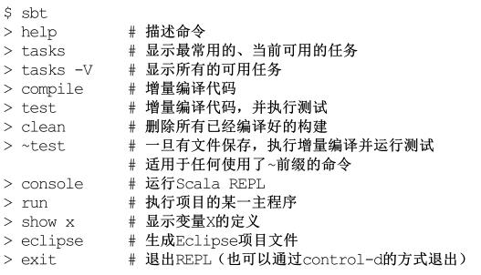

### 安装 Scala ###
-	**安装 Java**  
Scala 2.10 和 Scala 2.11 可以选择 Java 6、7、8三个版本。 Scala 2.12 只支持 Java 8。    
-	**安装 SBT**  
请遵循 [scala-sbt.org](https://www.scala-sbt.org/release/docs/Setup.html) 网页上的指示安装 SBT ，它是业内公认的构建工具。  
打开 shell 或命令行窗口，进入示例代码解压后的目录，敲入命令 sbt test ，该命令会下载所有的依赖项。  
SBT 会自动下载指定版本的 Scala 编译器、标准库以及需要的第三方资源。    
-	**安装 Scala**  
请遵循 [Scala 官方网站](http://www.scala-lang.org)中的链接安装 Scala ，还可以选择安装 [Scaladoc](https://www.scala-lang.org/files/archive/api/current/) 。     

### 使用 SBT ###
当你启动 sbt 命令时，假如不指定任何任务， SBT  将启动一个交互式REPL。  

### 执行 Scala 命令行工具 ###
如果单独安装了 Scala  命令行工具，会发现与 Java  编译器 javac 相似， Scala  编译器叫作 scalac 。  
在命令行窗口中运行 -version 命令，便可查看到当前运行的 scalac 版本以及命令行参数帮助信息。
<pre>$ scala -version 
Scala code runner version 2.11.8 -- Copyright 2002-2016, LAMP/EPFL</pre>

